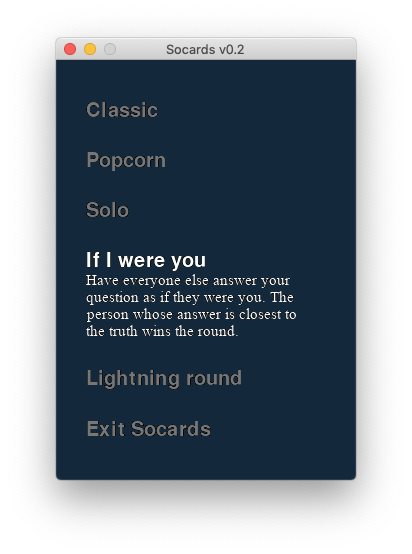

# So...
Collaboration between friends to learn Pygame whilst building a Socards implementation for personal use. For more information or to order a deck go to [socards.org](https://www.socards.org).

## Version 0.2
|  |  |
|:---|:---|

*Advanced menu stub, card render, modes.*

## Version 0.1
|  |
|:---:|

*Initial commit: draw card back.*
